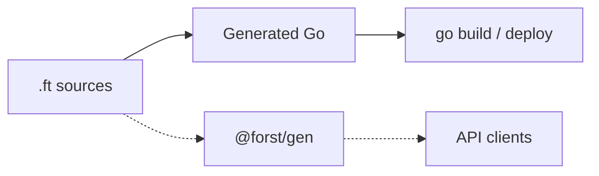

import CatalogOrder from "/snippets/catalog-order.mdx";

**Forst is a programming language that helps you move TypeScript backends to Golang.**

To accomplish this, it supports you in four key ways:

| Benefit | How it works |
| --- | --- |
| Go ecosystem | **Compiles directly to Go.** You get full access to the Go package ecosystem, standard library and build tools. |
| TypeScript integration | **Generates native TS definitions and a client** directly from your backend source. No need for intermediate languages like GraphQL or Protobuf just for type safety. |
| Node.js interop | **Call existing Node.js code** directly from Forst to keep your existing tools and libraries during migration. |
| Incremental migration | Allows you to **move small parts of your code at a time** while your existing codebase keeps running, so you can keep shipping during migration. |

## Why?

Building backend APIs often forces a trade off between runtime performance and developer speed. Maintaining separate schema contracts leads to lots of glue code. Full backend rewrites into more performant languages are often impossible to do safely.

Forst exists to remove that friction. You can migrate incrementally or write completely new backends with native performance and an ergonomic DX by design.

## Validation and errors

**Constraints** validate incoming data automatically before it reaches your
application logic. Constraints on the type replace manual checks at the
boundary:

<CatalogOrder />

<Info>
  Forst is actively developed. Some features are experimental. See the [roadmap](/resources/roadmap) for current status.
</Info>

## How it fits your stack

Forst compiles `.ft` sources to Go, and optionally emits TypeScript types for clients:

Run `forst generate` when clients need TypeScript from the same source.

## Start here

<CardGroup cols={2}>
  <Card title="Why Forst?" icon="circle-question" href="/why">
    Design priorities and what Forst omits.
  </Card>
  <Card title="Quickstart" icon="rocket" href="/quickstart">
    Install, write your first `.ft` file, and run it.
  </Card>
  <Card title="Language overview" icon="book" href="/language/overview">
    Go alignment, structural typing, and explicit control flow.
  </Card>
  <Card title="Describe a shape" icon="table-columns" href="/language/shapes-and-constraints">
    Types as schemas with built in constraints.
  </Card>
  <Card title="Mix with Go packages" icon="/icons/golang.svg" href="/interop/go">
    Import Go packages and mix `.ft` with `.go`.
  </Card>
</CardGroup>

## Examples and packages

- **Compiler examples:** [github.com/forst-lang/forst/tree/main/examples/in](https://github.com/forst-lang/forst/tree/main/examples/in)
- **npm compiler:** [`@forst/cli`](https://www.npmjs.com/package/@forst/cli)
- **Gradual adoption:** [`@forst/sidecar`](https://www.npmjs.com/package/@forst/sidecar) for invoking Forst from Node during migration

For client type generation, see [Generate client types](/interop/invoke/generate-types).
